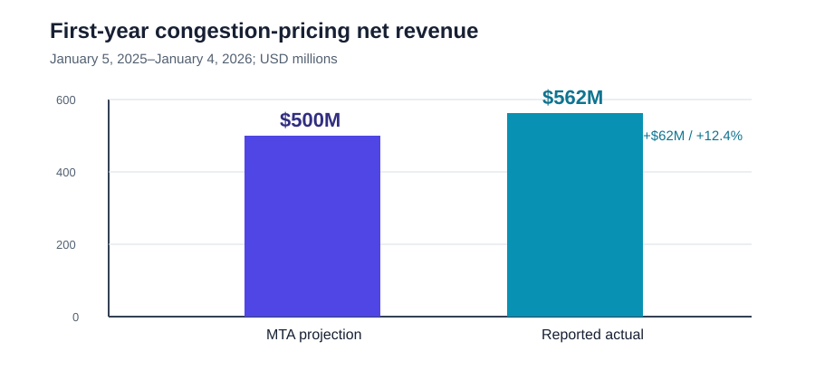
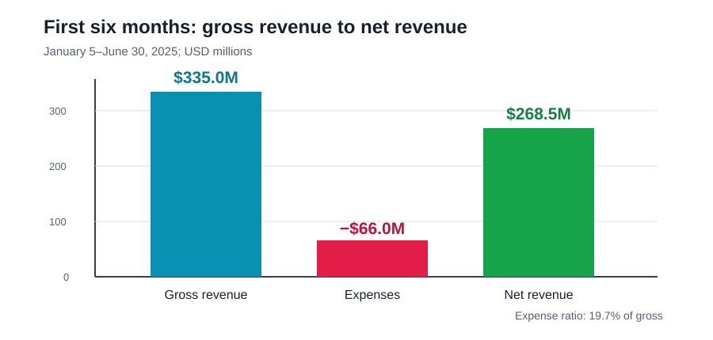
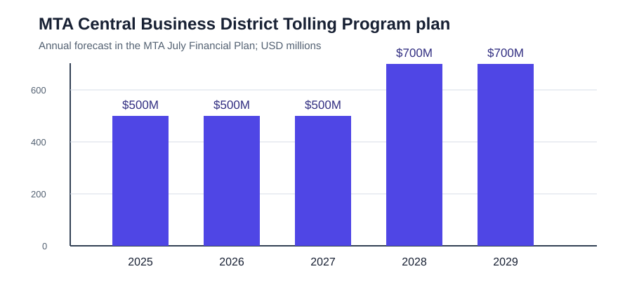

# NYC congestion-pricing revenue profile

## Answer

**$562 million** is the publicly reported **net revenue** from New York's Congestion Relief Zone toll for its first year (January 5, 2025–January 4, 2026). This is revenue of the MTA/TBTA program, not a receipt booked to New York City's general fund. The City of New York's 2026 official statement says the program has **no direct impact on the City's budget** and reports 2025 congestion-pricing revenue of $562 million.

## Can it be attributed to NYC residents?

No public source located provides toll payments by the vehicle owner's or driver's home borough. The published MTA revenue is an all-payer total: it includes people and businesses from the five boroughs, elsewhere in New York, other states, fleets, and visitors. The public Hugging Face taxi sample also has pickup and drop-off geography, **not passenger residence or payer address**. It therefore cannot answer “how much did residents of the five boroughs pay?”

The defensible public answer is thus: **$562M net for the program overall; borough-resident contribution is not publicly reported.**

## Data used

1. **Financial totals:** `revenue_profile.csv` transcribes only published MTA/City financial reporting. The January–June 2025 MTA report disclosed $335.0M gross revenue, $66.0M expenses, and $268.5M net revenue. The first-year total is $562.0M net.
2. **Required Hugging Face sample:** `hf_taxi_sample_100.csv` is a 100-row, first-page API sample from the public [ManoharHugs/nyc-taxi-2025-duckdb dataset](https://huggingface.co/datasets/ManoharHugs/nyc-taxi-2025-duckdb) (CC-BY-4.0). It includes `CBD Congestion Fee`, but its sampled trips date to January 1, 2025—before the toll began on January 5—so its CBD-fee value is zero and it is not used to calculate the program total.

## Summary statistics

| Measure | Value |
|---|---:|
| First-year net revenue | $562.0M |
| MTA 2025 projection (net) | $500.0M |
| Variance to projection | +$62.0M (+12.4%) |
| Jan.–Jun. 2025 gross revenue | $335.0M |
| Jan.–Jun. 2025 expenses | $66.0M |
| Jan.–Jun. 2025 net revenue | $268.5M |
| Jan.–Jun. expense ratio | 19.7% of gross |
| HF sample rows | 100 |
| HF sample time coverage | 2025-01-01 (pre-program) |
| Public residence field | Not available |

## Charts

## Data dictionary

See `data_dictionary.csv`. Values are in nominal US dollars; financial figures are shown in millions.

## Sources

- [City of New York, Preliminary Official Statement, March 17, 2026](https://www.nyc.gov/assets/investorrelations/downloads/pdf/go-bonds-statements/2026/nycgo-2026h2-4.pdf) — states that the program has no direct City-budget impact and reports $562M in 2025 revenue.
- [MTA Finance Committee minutes, July 2025](https://www.mta.info/document/186851) — reports $335M year-to-date revenue, $66M expenses, and $268.5M net revenue after six months.
- [MTA July Financial Plan 2026–2029](https://www.mta.info/document/180056) — documents the program start date, lockbox treatment, and the $500M annual 2025–2027 projection.
- [Hugging Face dataset card: ManoharHugs/nyc-taxi-2025-duckdb](https://huggingface.co/datasets/ManoharHugs/nyc-taxi-2025-duckdb) — public taxi-trip sample used for the required dataset sample.

## Reproducibility notes

The Hugging Face sample was requested from the public dataset server with `offset=0` and `length=100` on September 8, 2026. Financial figures are intentionally not extrapolated from the taxi sample: its coverage is neither complete nor resident-identifying.
